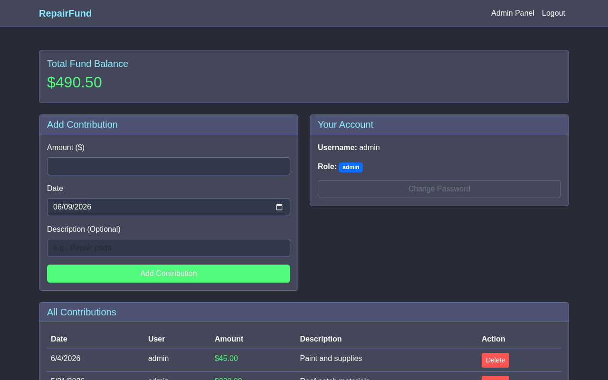
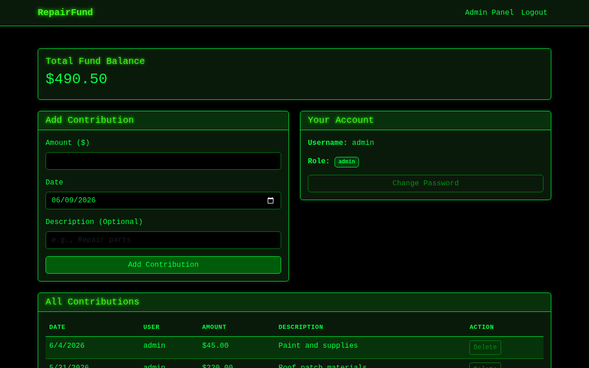
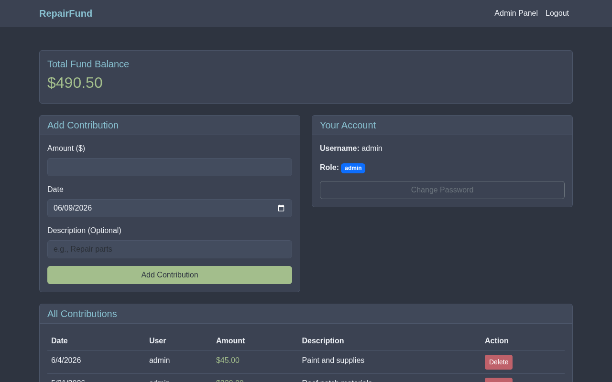
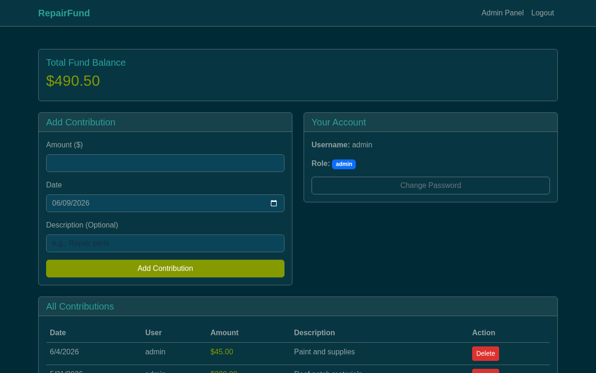
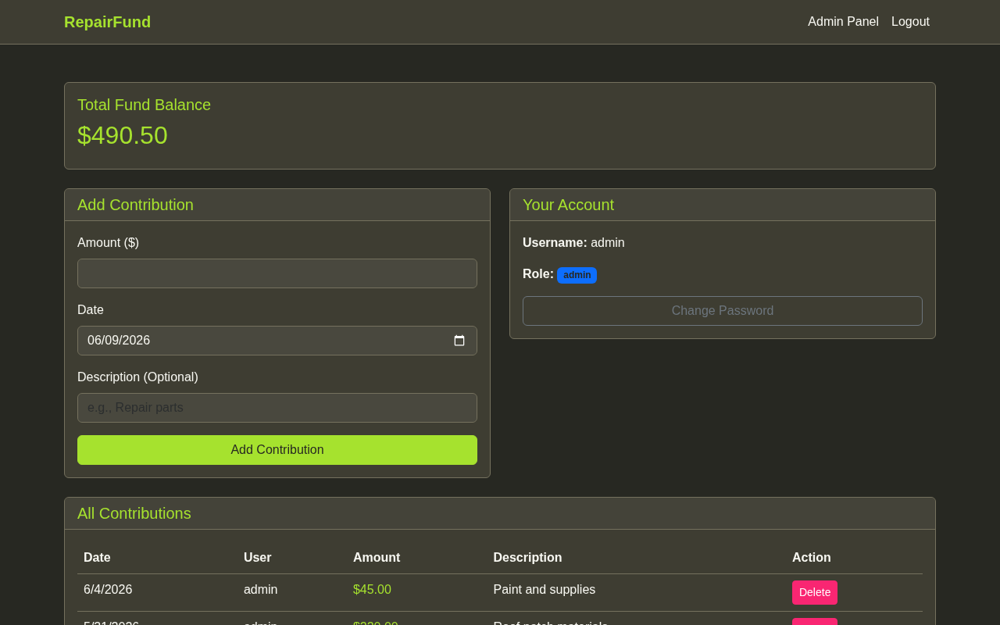
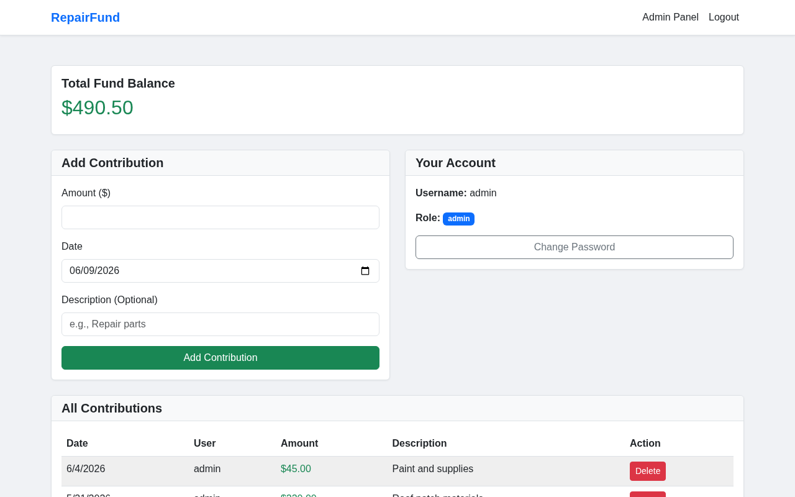
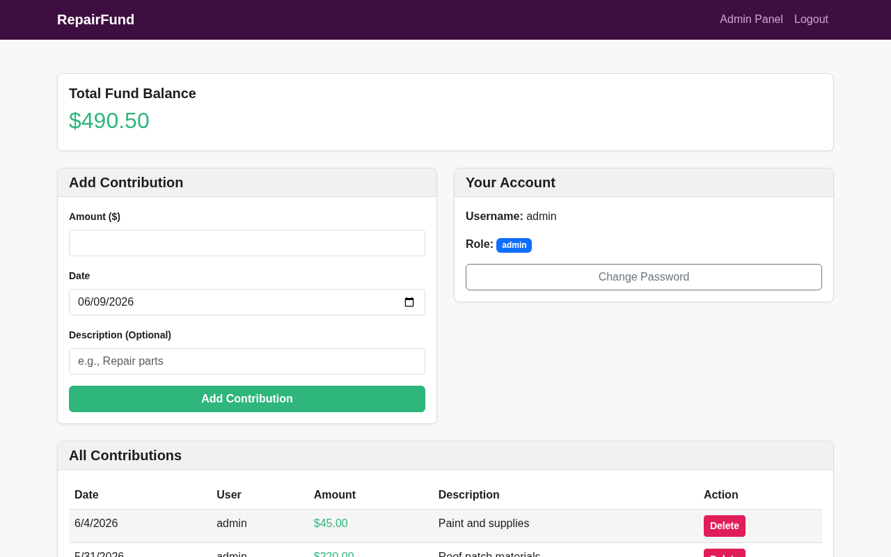

# RepairFund — Themes

Themes are selectable in the **Admin Panel → Appearance** tab. The choice is saved in the browser and persists across page loads. Each user can have a different theme in their own browser.

| Theme | Style | Description |
|---|---|---|
| Dracula | Dark | Purple/cyan palette — the default |
| Matrix | Dark | Monospace green-on-black terminal aesthetic |
| Nord | Dark | Arctic blue-grey palette, popular in dev tooling |
| Solarized Dark | Dark | Iconic warm teal-black with cyan/blue accents |
| Monokai | Dark | Vibrant lime/pink/purple on warm dark background |
| Light | Light | Clean white/grey professional theme |
| Slack | Mixed | Aubergine navbar with clean white content area |

## Screenshots

### Dracula (default)

### Matrix

### Nord

### Solarized Dark

### Monokai

### Light

### Slack

## Theme System

Each theme is a standalone CSS file in `frontend/css/`. Themes override Bootstrap 5 using CSS custom properties defined in `:root`. The active theme name is stored in `localStorage` under the key `repairfund-theme` and applied immediately on page load to prevent flash.

To add a new theme: create `frontend/css/<name>.css` following the structure of any existing theme, then add an `<option value="<name>">` to the select in `admin.html`.
